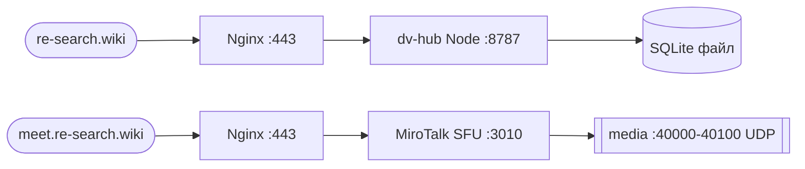

# Infrastructure Runbook — DV Hub

> Операционный мануал для re-search.wiki. Источник истины по серверу.
> Обновляется при каждом изменении инфраструктуры. Заполняется по ходу выполнения DV-006a → DV-027.
> Никаких секретов в этом файле — только ссылки на хранилище ключей.

**Status**: 🚧 в процессе — DV-006a выполнено, остальные разделы заполняются по мере выполнения DV-008..DV-027.

---

## 1. Архитектура и адреса

### Домены

| Домен | Назначение | Status |
|---|---|---|
| `re-search.wiki` | Основной сайт dv-hub | TODO (DV-005) |
| `www.re-search.wiki` | Redirect → re-search.wiki | TODO |
| `meet.re-search.wiki` | MiroTalk SFU (видеосвязь) | TODO (DV-011, скрипт готов) |
| `drive.re-search.wiki` | Twake Drive (Phase 2) | LATER |

### Сервер

- **Провайдер**: Fornex
- **Тариф**: 2 vCPU / 4 GB RAM / 40 GB NVMe Fast (CPU 3.0 GHz min)
- **Регион**: Germany
- **OS**: Ubuntu 24.04 LTS
- **IP**: 89.127.198.185
- **Hostname**: `dv-hub.host`

### Сетевая схема



### Порты

| Порт | Протокол | Назначение | Открыт наружу |
|---|---|---|---|
| 28108 | TCP | SSH (нестандартный) | да (key-only) |
| 80 | TCP | HTTP → 301 на HTTPS | да |
| 443 | TCP | HTTPS (Nginx) | да |
| 3010 | TCP | MiroTalk SFU (за Nginx) | нет |
| 8787 | TCP | dv-hub Node (за Nginx) | нет |
| 40000-40100 | TCP+UDP | MiroTalk media | да |

### Контакты

- Поддержка Fornex: панель https://ru.fornex.com (тикеты в панели управления)
- Поддержка Namecheap (домен): https://www.namecheap.com/support/
- Owner: Max (msivyhin@gmail.com)

---

## 2. Доступ

### SSH

- Пользователь: `dv` (не root)
- Аутентификация: только ключ, парольный вход отключён
- Порт: 28108 (нестандартный, стандартный 22 закрыт)
- Команда: `ssh -p 28108 dv@re-search.wiki`
- Ключи: см. `DV/Site/keys-passwords.mdenc` (зашифрованный файл в волте, не в репо)

### Кто имеет доступ

TODO: список после раздачи ключей.

### Восстановление доступа

Если потерял ключ:

1. Войти в панель Fornex https://ru.fornex.com/
2. Использовать VNC console для доступа к серверу
3. Добавить новый публичный ключ в `~/.ssh/authorized_keys`

---

## 3. Развёртывание с нуля

> Используется при пересоздании сервера или подъёме staging.
> Команды копируются сюда **по факту выполнения** во время DV-006a..DV-027.

### 3.1 Базовая настройка сервера (DV-006a) — ВЫПОЛНЕНО

> **Контекст**: Первоначальная настройка Ubuntu 24.04 LTS на Fornex VPS (Germany).
> **Цель**: Создать безопасную базовую среду для продакшен-нагрузки.

```bash
# === ЭТАП 1: Первоначальное подключение (от root) ===

# Подключиться как root (пароль из панели Fornex)
# Зачем: root нужен для первоначальной настройки, потом будем работать от пользователя dv
ssh root@<IP-адрес-сервера>

# Обновить списки пакетов
# Зачем: чтобы установить последние версии пакетов с исправлениями безопасности
apt update

# Обновить все установленные пакеты
# Зачем: применить security patches и bug fixes
apt upgrade -y

# Установить базовые утилиты
# Зачем: curl/wget для скачивания, git для кода, nano для редактирования конфигов, htop для мониторинга
apt install -y curl wget git nano htop

# Установить hostname
# Зачем: dv-hub.host — понятное имя сервера для логов и мониторинга
hostnamectl set-hostname dv-hub.host

# Установить timezone (Москва)
# Зачем: все логи и timestamps в БД должны быть в одном часовом поясе (МСК для русскоязычной аудитории)
timedatectl set-timezone Europe/Moscow

# === ЭТАП 2: Создание пользователя dv ===

# Создать пользователя dv с домашней директорией
# Зачем: не работать от root — это опасно. dv = "discussion evenings"
adduser dv

# Добавить в группу sudo
# Зачем: чтобы dv мог выполнять команды с правами root через sudo
usermod -aG sudo dv

# Переключиться на пользователя dv
su - dv

# Создать директорию для SSH-ключей
mkdir -p ~/.ssh
chmod 700 ~/.ssh

# Создать файл authorized_keys и вставить публичный ключ
# Зачем: вход по ключу безопаснее пароля (нельзя подобрать брутфорсом)
nano ~/.ssh/authorized_keys
# Вставить содержимое ~/.ssh/id_rsa.pub с локальной машины
chmod 600 ~/.ssh/authorized_keys

# Вернуться к root
exit

# === ЭТАП 3: Hardening SSH ===

# Открыть конфиг SSH
nano /etc/ssh/sshd_config

# Изменить параметры:
# Port 28108                    # Нестандартный порт — снижает количество автоматических атак
# PermitRootLogin no            # Запретить вход root по SSH
# PasswordAuthentication no     # Только ключи, никаких паролей
# PubkeyAuthentication yes      # Включить аутентификацию по ключу
# MaxAuthTries 3                # Максимум 3 попытки ввода пароля

# Проверить конфигурацию (не должно быть ошибок)
sshd -t

# Перезапустить SSH
systemctl restart ssh

# ВАЖНО: Открыть НОВЫЙ терминал и проверить вход:
# ssh -p 28108 dv@<IP-адрес>
# Если работает — закрыть старую сессию. Если нет — исправить конфиг!

# === ЭТАП 4: Firewall (UFW) ===

# Установить ufw
apt install -y ufw

# Политики по умолчанию: блокировать входящие, разрешить исходящие
ufw default deny incoming
ufw default allow outgoing

# Открыть SSH (нестандартный порт)
ufw allow 28108/tcp comment 'SSH (custom port)'

# Открыть HTTP (для редиректа на HTTPS и certbot)
ufw allow 80/tcp comment 'HTTP'

# Открыть HTTPS
ufw allow 443/tcp comment 'HTTPS'

# Открыть MiroTalk SFU (веб-интерфейс)
ufw allow 3010/tcp comment 'MiroTalk SFU'

# Открыть MiroTalk media (WebRTC) — диапазон портов для видео/аудио потоков
ufw allow 40000:40100/tcp comment 'MiroTalk media TCP'
ufw allow 40000:40100/udp comment 'MiroTalk media UDP'

# Включить firewall
# Зачем: блокирует все порты кроме разрешённых — защита от сканирования
ufw enable

# Проверить статус
ufw status verbose

# === ЭТАП 5: Fail2ban ===

# Установить fail2ban
# Зачем: автоматически банит IP после 3 неудачных попыток входа — защита от брутфорса
apt install -y fail2ban

# Создать локальный конфиг
nano /etc/fail2ban/jail.local

# Содержимое jail.local:
# [DEFAULT]
# bantime = 1h          # Бан на 1 час
# findtime = 10m        # Окно для подсчёта попыток
# maxretry = 3          # Максимум 3 попытки
# backend = systemd
#
# [sshd]
# enabled = true
# port = ssh
# filter = sshd
# logpath = /var/log/auth.log
# maxretry = 3
# bantime = 1h

# Перезапустить fail2ban
systemctl restart fail2ban
systemctl enable fail2ban

# Проверить статус
systemctl status fail2ban
fail2ban-client status sshd
```

**Примечания:**
- Swap НЕ создавался — при необходимости проще расширить RAM через панель Fornex
- Timezone: Europe/Moscow (не Berlin) — платформа ориентирована на МСК
- SSH порт: 28108 (нестандартный) — снижает шум от ботов

### 3.2 Установка стека (DV-006a) — ВЫПОЛНЕНО

> **Контекст**: Установка Node.js, PM2, Nginx, certbot и других зависимостей.

```bash
# === Базовые пакеты ===

# Установить всё необходимое
# Зачем: build-essential для компиляции npm-пакетов, nginx как reverse proxy, ffmpeg для обработки медиа
apt install -y \
  build-essential \
  git \
  curl \
  wget \
  unzip \
  nginx \
  snapd \
  ffmpeg \
  software-properties-common \
  apt-transport-https \
  ca-certificates \
  gnupg \
  lsb-release

# === Certbot (Let's Encrypt) ===

# Установить snap core
snap install core
snap refresh core

# Установить certbot через snap
# Зачем snap: официальная рекомендация Let's Encrypt, всегда актуальная версия
snap install --classic certbot

# Создать symlink для удобства
ln -s /snap/bin/certbot /usr/bin/certbot

# Проверить версию
certbot --version

# === Node.js через nvm (от пользователя dv) ===

# Переключиться на dv
su - dv

# Скачать и установить nvm
# Зачем nvm: позволяет легко переключаться между версиями Node.js
curl -o- https://raw.githubusercontent.com/nvm-sh/nvm/v0.39.7/install.sh | bash

# Перезагрузить shell
source ~/.bashrc

# Установить последнюю LTS версию
# Зачем LTS: стабильная версия с долгосрочной поддержкой
nvm install --lts
nvm use --lts
nvm alias default lts/*

# Проверить версии
node --version
npm --version

# === PM2 ===

# Установить PM2 глобально
# Зачем: process manager для Node.js — автоперезапуск, логи, мониторинг
npm install -g pm2

# Настроить автозапуск PM2 при перезагрузке сервера
pm2 startup
# Скопировать и выполнить команду, которую выведет pm2 startup

# Проверить версию
pm2 --version

# === Nginx ===

# Вернуться к root
exit

# Проверить статус Nginx
systemctl status nginx

# Если не запущен — запустить
systemctl start nginx
systemctl enable nginx

# Создать директории для доменов
mkdir -p /var/www/re-search.wiki
mkdir -p /var/www/meet.re-search.wiki

# Установить владельца (пользователь dv)
chown -R dv:dv /var/www/re-search.wiki
chown -R dv:dv /var/www/meet.re-search.wiki

# Установить права
chmod -R 755 /var/www
```

**Проверка после установки:**
```bash
# От пользователя dv:
node --version    # Должно показать v20.x.x или v22.x.x
npm --version     # Должно показать 10.x.x
pm2 --version     # Должно показать 5.x.x

# От root:
nginx -v          # Должно показать nginx version
certbot --version # Должно показать certbot version
systemctl status nginx  # Должно быть active (running)
```

### 3.3 Деплой dv-hub (DV-008) — ВЫПОЛНЕНО

> **Контекст**: Первый деплой Node.js приложения на VPS через PM2.
> **Стек**: Node.js 22 + better-sqlite3 + @hono/node-server, порт 8787.

```bash
# === Локальная сборка и деплой ===

# Вариант 1: Автоматический (рекомендуется)
bash scripts/deploy-vps.sh

# Вариант 2: Ручной
npm run build
rsync -avz --delete \
  --exclude 'node_modules' --exclude '.git' --exclude '.wrangler' \
  --exclude '.env' --exclude 'data' \
  -e "ssh -i ~/.ssh/id_ed25519 -p 28108" ./ dv@re-search.wiki:/opt/dv-hub/

ssh -i ~/.ssh/id_ed25519 -p 28108 dv@re-search.wiki << 'REMOTE'
  cd /opt/dv-hub
  npm ci --omit=dev
  node scripts/init-db.js
  pm2 restart dvhub || pm2 start ecosystem.config.cjs
  pm2 save
REMOTE

# === Первоначальная настройка на VPS ===

# 1. Скопировать .env.example в .env и заполнить секреты
cp .env.example .env
nano .env  # заполнить TELEGRAM_BOT_TOKEN, RESEND_API_KEY, RESEND_FROM_EMAIL и т.д.

# 2. Инициализировать базу данных
node scripts/init-db.js

# 3. Запустить через PM2
pm2 start ecosystem.config.cjs
pm2 save
pm2 startup  # скопировать и выполнить выведенную команду

# === Локальная разработка ===

# Dev-режим с автоперезагрузкой (tsx watch)
npm run dev

# Или собрать и запустить
npm run build && npm start
```

**Примечания:**
- База данных создаётся автоматически при первом запуске (все миграции idempotent)
- SQLite файл: `data/dv-hub.db` (WAL mode)
- Статические файлы раздаются из `public/` директории
- PM2 конфиг: `ecosystem.config.cjs` (имя процесса: `dvhub`, порт: 8787)

### 3.4 Деплой MiroTalk SFU (DV-011) — TODO (скрипт готов, требуется тестирование на VPS)

> **Контекст**: Развёртывание MiroTalk SFU для видеозвонков на meet.re-search.wiki.
> **Скрипт**: `scripts/deploy-mirotalk.sh` (автоматизирует clone → .env → npm install → PM2)
> **Nginx reference**: `scripts/nginx-meet.conf`
> **Подробная инструкция**: `docs/mirotalk-setup.md`

```bash
# === Автоматический деплой ===
bash scripts/deploy-mirotalk.sh

# === Post-deploy: настроить .env ===
ssh -i ~/.ssh/id_ed25519 -p 28108 dv@re-search.wiki
cd /opt/mirotalksfu
nano .env
# Установить:
#   HTTP_PORT=3010
#   HTTPS=false (SSL на Nginx)
#   SFU_ANNOUNCED_IP=89.127.198.185
#   API_KEY_SECRET=<openssl rand -hex 32>

# Перезапустить
pm2 restart mirotalksfu

# === Проверка ===
pm2 status mirotalksfu
curl -I https://meet.re-search.wiki

# === Firewall: media ports (если ещё не открыты) ===
sudo ufw allow 40000:40100/tcp comment 'MiroTalk media TCP'
sudo ufw allow 40000:40100/udp comment 'MiroTalk media UDP'
```

**Примечания:**
- SSL для meet.re-search.wiki уже настроен через certbot (DV-027)
- Nginx reverse proxy уже сконфигурирован (DV-027)
- MiroTalk использует свой ecosystem.config.js (не наш ecosystem.config.cjs)
- При обновлении: `cd /opt/mirotalksfu && git pull && npm install && pm2 restart mirotalksfu`

### 3.5 Nginx + SSL (DV-027) — ВЫПОЛНЕНО

> **Контекст**: Настройка reverse proxy для трёх доменов и получение SSL-сертификатов через Let's Encrypt.

```bash
# === Шаг 1: Создание Nginx конфигов (ТОЛЬКО HTTP) ===

# Для re-search.wiki
sudo nano /etc/nginx/sites-available/re-search.wiki
```

```nginx
server {
    listen 80;
    server_name re-search.wiki www.re-search.wiki;

    location / {
        proxy_pass http://127.0.0.1:8787;
        proxy_http_version 1.1;
        proxy_set_header Upgrade $http_upgrade;
        proxy_set_header Connection 'upgrade';
        proxy_set_header Host $host;
        proxy_cache_bypass $http_upgrade;
        proxy_set_header X-Real-IP $remote_addr;
        proxy_set_header X-Forwarded-For $proxy_add_x_forwarded_for;
        proxy_set_header X-Forwarded-Proto $scheme;
    }
}
```

```bash
# Для meet.re-search.wiki
sudo nano /etc/nginx/sites-available/meet.re-search.wiki
```

```nginx
server {
    listen 80;
    server_name meet.re-search.wiki;

    location / {
        proxy_pass http://127.0.0.1:3010;
        proxy_http_version 1.1;
        proxy_set_header Upgrade $http_upgrade;
        proxy_set_header Connection 'upgrade';
        proxy_set_header Host $host;
        proxy_cache_bypass $http_upgrade;
        proxy_set_header X-Real-IP $remote_addr;
        proxy_set_header X-Forwarded-For $proxy_add_x_forwarded_for;
        proxy_set_header X-Forwarded-Proto $scheme;
    }
}
```

```bash
# === Шаг 2: Активация конфигов ===

# Создать symlink'и
sudo ln -s /etc/nginx/sites-available/re-search.wiki /etc/nginx/sites-enabled/
sudo ln -s /etc/nginx/sites-available/meet.re-search.wiki /etc/nginx/sites-enabled/

# Удалить default конфиг (если есть)
sudo rm /etc/nginx/sites-enabled/default

# Проверить конфигурацию
sudo nginx -t

# Перезапустить Nginx
sudo systemctl restart nginx

# === Шаг 3: Получение SSL сертификатов ===

# Certbot сам добавит SSL директивы и redirect с HTTP на HTTPS
sudo certbot --nginx -d re-search.wiki -d www.re-search.wiki -d meet.re-search.wiki

# === Шаг 4: Настройка автообновления сертификатов ===

# Создать systemd service
sudo nano /etc/systemd/system/certbot.service
```

```ini
[Unit]
Description=Certbot
After=network-online.target

[Service]
Type=oneshot
ExecStart=/usr/bin/certbot renew --quiet
PrivateTmp=true
```

```bash
# Создать systemd timer
sudo nano /etc/systemd/system/certbot.timer
```

```ini
[Unit]
Description=Run certbot twice daily

[Timer]
OnBootSec=5min
OnUnitActiveSec=12h
RandomizedDelaySec=1h

[Install]
WantedBy=timers.target
```

```bash
# Перезагрузить systemd
sudo systemctl daemon-reload

# Включить и запустить timer
sudo systemctl enable certbot.timer
sudo systemctl start certbot.timer

# === Шаг 5: Проверка ===

# Проверить сертификаты
sudo certbot certificates

# Проверить timer
sudo systemctl status certbot.timer

# С локальной машины
curl -I https://re-search.wiki
curl -I https://meet.re-search.wiki
```

**Примечания:**
- `certbot renew --dry-run` может показывать ошибку для свежих сертификатов — это нормально
- Реальное автообновление работает через systemd timer (2 раза в день)
- Пока приложения не задеплоены, Nginx возвращает 502 Bad Gateway — это ожидаемо

### 3.6 Миграция БД с Cloudflare D1 (DV-007) — ВЫПОЛНЕНО

> **Контекст**: Перенос данных из Cloudflare D1 в локальный SQLite файл.
> **Дата**: 2026-06-10

```bash
# === Экспорт из Cloudflare D1 ===

# Локально: экспортировать данные
wrangler d1 export dv-hub-production --output=./backup.sql

# === Очистка backup от Cloudflare-специфичных элементов ===

# Удалить таблицу d1_migrations (специфична для Cloudflare)
# Добавить таблицы из миграции 0002 (email_tokens, messages)
# Результат: clean-backup.sql

# === Импорт на сервер ===

# Скопировать на сервер
scp -i ~/.ssh/id_ed25519 -P 28108 clean-backup.sql dv@re-search.wiki:/opt/dv-hub/

# На сервере: удалить текущую БД и импортировать
ssh -i ~/.ssh/id_ed25519 -p 28108 dv@re-search.wiki
cd /opt/dv-hub
rm data/dv-hub.db data/dv-hub.db-wal data/dv-hub.db-shm
sqlite3 data/dv-hub.db < clean-backup.sql

# Проверить таблицы
sqlite3 data/dv-hub.db ".tables"

# Проверить данные
sqlite3 data/dv-hub.db "SELECT 'cells', COUNT(*) FROM cells UNION ALL SELECT 'users', COUNT(*) FROM users UNION ALL SELECT 'materials', COUNT(*) FROM materials;"

# Перезапустить приложение
pm2 restart dvhub
```

**Мигрированные данные:**
- cells: 1 (Дискуссионные Вечера)
- users: 1 (Макс Рудра, admin)
- materials: 3
- topics: 3
- discussion_rooms: 1
- publications: 1
- email_tokens: 0 (новая таблица)
- messages: 0 (новая таблица)

**Примечания:**
- Файлы backup.sql и clean-backup.sql сохранены в репозитории для истории
- d1_migrations таблица удалена (специфична для Cloudflare)
- Таблицы email_tokens и messages добавлены из миграции 0002

---

## 4. Обновления и rollback

### Обновление dv-hub

```bash
cd /opt/dv-hub
git pull origin main
npm ci --omit=dev
npm run build
pm2 restart dvhub
pm2 logs dvhub --lines 50
```

### Обновление MiroTalk SFU

```bash
cd /opt/mirotalksfu
git pull
npm ci
pm2 restart mirotalksfu
```

### Rollback dv-hub

```bash
cd /opt/dv-hub
git log --oneline -10
git checkout <sha>
npm ci --omit=dev && npm run build
pm2 restart dvhub
```

При откате после миграции БД — сначала откатить миграцию (см. раздел 6), потом код.

---

## 5. Мониторинг и логи

### Быстрая проверка здоровья

```bash
pm2 status
pm2 logs --lines 30
df -h
free -m
systemctl status nginx
ufw status
curl -I https://re-search.wiki
```

### Логи

| Что | Где | Команда |
|---|---|---|
| dv-hub | `~/.pm2/logs/dvhub-*.log` | `pm2 logs dvhub` |
| MiroTalk | `~/.pm2/logs/mirotalksfu-*.log` | `pm2 logs mirotalksfu` |
| Nginx access | `/var/log/nginx/access.log` | `tail -f /var/log/nginx/access.log` |
| Nginx error | `/var/log/nginx/error.log` | `tail -f /var/log/nginx/error.log` |
| System | journalctl | `journalctl -u nginx -f` |
| Auth | `/var/log/auth.log` | `sudo tail -f /var/log/auth.log` |

### Алёрты

Пока нет (см. ADR-001). При появлении — Uptime Kuma как отдельный сервис.

---

## 6. Бэкапы и восстановление

### Что бэкапим

- SQLite файл: `/opt/dv-hub/data/dv-hub.db`
- `.env` файлы: `/opt/dv-hub/.env`, `/opt/mirotalksfu/.env`
- Nginx конфиги: `/etc/nginx/sites-available/`
- Загрузки: `/opt/dv-hub/uploads/` (до Twake Drive)

### Метод

TODO (DV-009): rsync на внешнее хранилище.
Временный вариант на этапе MVP — ручной `tar` раз в неделю на локальный ноут.

### Расписание

TODO: cron-задача после DV-009.

### Восстановление

TODO: проверить как минимум один раз, что бэкап разворачивается.

---

## 7. Troubleshooting

### Сайт не открывается

```bash
pm2 status
systemctl status nginx
curl -I http://localhost:8787
sudo nginx -t
df -h
```

### Видео не работает (MiroTalk)

1. Проверить порты: `sudo ufw status | grep 40000`
2. Логи: `pm2 logs mirotalksfu --lines 100`
3. Если пользователь за симметричным NAT — нужен TURN (ADR-007, DV-012)
4. Проверить `SFU_ANNOUNCED_IP` в `.env` равен публичному IP

### SSL сертификат истекает / истёк

```bash
sudo certbot certificates
sudo certbot renew --dry-run
sudo certbot renew
sudo systemctl reload nginx
```

Автообновление через systemd timer должно работать, проверь: `systemctl status certbot.timer`.

### Диск переполнен

```bash
du -sh /var/log/* | sort -h
du -sh /opt/*
pm2 flush
journalctl --vacuum-time=7d
```

### Высокая память (5 GB впритык при созвоне)

Это известное ограничение (ADR-002). Решения по эскалации:

1. Уменьшить количество одновременных участников комнаты
2. Перейти на тариф с 8 GB RAM у Fornex (настраиваемый тариф)
3. Вынести MiroTalk на отдельный сервер

### Не пускает по SSH

Использовать VNC console в панели Fornex, проверить:

```bash
sudo tail -50 /var/log/auth.log
sudo systemctl status ssh
sudo ufw status
```

---

## 8. Регулярное обслуживание

### Еженедельно (понедельник, 15 мин)

```bash
ssh dv@re-search.wiki
sudo apt update && sudo apt upgrade -y
sudo certbot renew --dry-run
pm2 flush
df -h
pm2 status
```

### Ежемесячно (30 мин)

- Проверить что последний бэкап разворачивается (после DV-009)
- Audit ufw rules: `sudo ufw status numbered`
- Проверить fail2ban: `sudo fail2ban-client status sshd`
- Обновить этот runbook если что-то менялось

### Ежеквартально

- Ротация SSH-ключей (если в команде кто-то ушёл)
- Ротация `GITHUB_TOKEN` (если используется на сервере)
- Проверить актуальность ADR в `docs/architecture.md` vs реальный сервер

---

## Журнал изменений

| Дата | Что | Кто |
|---|---|---|
| 2026-05-25 | Создан скелет (DV-029) | Max |
| 2026-06-04 | DV-006a: базовая настройка сервера (SSH hardening, ufw, fail2ban, стек) | Max |
| 2026-06-08 | DV-007/DV-008: миграция с Cloudflare Workers на Node.js + better-sqlite3 | Build Agent |
| 2026-06-10 | DV-008: первый деплой dv-hub на VPS (Node.js 22 + PM2) | Max |
| 2026-06-10 | DV-007: миграция БД с Cloudflare D1 на локальный SQLite | Max |
| 2026-06-19 | DV-011: деплой MiroTalk SFU на meet.re-search.wiki | Max |
