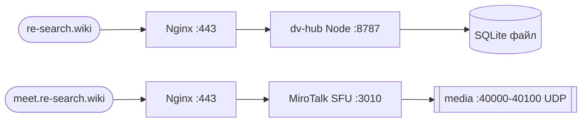

# Infrastructure Runbook — DV Hub

> Операционный мануал для re-search.wiki. Источник истины по серверу.
> Обновляется при каждом изменении инфраструктуры. Заполняется по ходу выполнения DV-006a → DV-027.
> Никаких секретов в этом файле — только ссылки на хранилище ключей.

**Status**: 🚧 skeleton — заполняется в рамках DV-029. Большая часть разделов TODO до развёртывания VPS.

---

## 1. Архитектура и адреса

### Домены

| Домен | Назначение | Status |
|---|---|---|
| `re-search.wiki` | Основной сайт dv-hub | TODO (DV-005) |
| `www.re-search.wiki` | Redirect → re-search.wiki | TODO |
| `meet.re-search.wiki` | MiroTalk SFU (видеосвязь) | TODO (DV-011) |
| `drive.re-search.wiki` | Twake Drive (Phase 2) | LATER |

### Сервер

- **Провайдер**: Zomro
- **Тариф**: Standard Intel (2 vCPU / 5 GB RAM / 35 GB NVMe)
- **Регион**: Poland
- **OS**: Ubuntu 22.04 LTS
- **IP**: TODO (заполнить после DV-006)
- **Hostname**: `dvhub-prod-01` (предложение)

### Сетевая схема



### Порты

| Порт | Протокол | Назначение | Открыт наружу |
|---|---|---|---|
| 22 | TCP | SSH | да (rate-limit, key-only) |
| 80 | TCP | HTTP → 301 на HTTPS | да |
| 443 | TCP | HTTPS (Nginx) | да |
| 3010 | TCP | MiroTalk SFU (за Nginx) | нет |
| 8787 | TCP | dv-hub Node (за Nginx) | нет |
| 40000-40100 | TCP+UDP | MiroTalk media | да |

### Контакты

- Поддержка Zomro: панель https://cp.zomro.com/
- Поддержка Namecheap (домен): https://www.namecheap.com/support/
- Owner: Max (msivyhin@gmail.com)

---

## 2. Доступ

### SSH

- Пользователь: `dv` (не root)
- Аутентификация: только ключ, парольный вход отключён
- Команда: `ssh dv@re-search.wiki`
- Ключи: см. `DV/Site/keys-passwords.mdenc` (зашифрованный файл в волте, не в репо)

### Кто имеет доступ

TODO: список после раздачи ключей.

### Восстановление доступа

Если потерял ключ:

1. Войти в панель Zomro https://cp.zomro.com/
2. Использовать VNC console для доступа к серверу
3. Добавить новый публичный ключ в `~/.ssh/authorized_keys`

---

## 3. Развёртывание с нуля

> Используется при пересоздании сервера или подъёме staging.
> Команды копируются сюда **по факту выполнения** во время DV-006a..DV-027.

### 3.1 Базовая настройка сервера (DV-006a) — TODO

```bash
# скопировать сюда финальные команды после выполнения задачи
# (создание пользователя, ufw, swap, fail2ban, apt update)
```

### 3.2 Установка стека (DV-006a) — TODO

```bash
# nvm + Node LTS, pm2, nginx, certbot, ffmpeg
```

### 3.3 Деплой dv-hub (DV-008) — TODO

```bash
# git clone, npm ci, npm run build, pm2 start ecosystem.config.cjs
```

### 3.4 Деплой MiroTalk SFU (DV-011) — TODO

```bash
# git clone mirotalksfu, env, pm2 start
```

### 3.5 Nginx + SSL (DV-027) — TODO

```bash
# server blocks для трёх хостов, certbot --nginx
```

---

## 4. Обновления и rollback

### Обновление dv-hub

```bash
cd /opt/dv-hub
git pull origin main
npm ci --omit=dev
npm run build
pm2 restart dvhub
pm2 logs dvhub --lines 50
```

### Обновление MiroTalk SFU

```bash
cd /opt/mirotalksfu
git pull
npm ci
pm2 restart mirotalksfu
```

### Rollback dv-hub

```bash
cd /opt/dv-hub
git log --oneline -10
git checkout <sha>
npm ci --omit=dev && npm run build
pm2 restart dvhub
```

При откате после миграции БД — сначала откатить миграцию (см. раздел 6), потом код.

---

## 5. Мониторинг и логи

### Быстрая проверка здоровья

```bash
pm2 status
pm2 logs --lines 30
df -h
free -m
systemctl status nginx
ufw status
curl -I https://re-search.wiki
```

### Логи

| Что | Где | Команда |
|---|---|---|
| dv-hub | `~/.pm2/logs/dvhub-*.log` | `pm2 logs dvhub` |
| MiroTalk | `~/.pm2/logs/mirotalksfu-*.log` | `pm2 logs mirotalksfu` |
| Nginx access | `/var/log/nginx/access.log` | `tail -f /var/log/nginx/access.log` |
| Nginx error | `/var/log/nginx/error.log` | `tail -f /var/log/nginx/error.log` |
| System | journalctl | `journalctl -u nginx -f` |
| Auth | `/var/log/auth.log` | `sudo tail -f /var/log/auth.log` |

### Алёрты

Пока нет (см. ADR-001). При появлении — Uptime Kuma как отдельный сервис.

---

## 6. Бэкапы и восстановление

### Что бэкапим

- SQLite файл: `/opt/dv-hub/data/dv-hub.db`
- `.env` файлы: `/opt/dv-hub/.env`, `/opt/mirotalksfu/.env`
- Nginx конфиги: `/etc/nginx/sites-available/`
- Загрузки: `/opt/dv-hub/uploads/` (до Twake Drive)

### Метод

TODO (DV-009): rsync на внешнее хранилище.
Временный вариант на этапе MVP — ручной `tar` раз в неделю на локальный ноут.

### Расписание

TODO: cron-задача после DV-009.

### Восстановление

TODO: проверить как минимум один раз, что бэкап разворачивается.

---

## 7. Troubleshooting

### Сайт не открывается

```bash
pm2 status
systemctl status nginx
curl -I http://localhost:8787
sudo nginx -t
df -h
```

### Видео не работает (MiroTalk)

1. Проверить порты: `sudo ufw status | grep 40000`
2. Логи: `pm2 logs mirotalksfu --lines 100`
3. Если пользователь за симметричным NAT — нужен TURN (ADR-007, DV-012)
4. Проверить `SFU_ANNOUNCED_IP` в `.env` равен публичному IP

### SSL сертификат истекает / истёк

```bash
sudo certbot certificates
sudo certbot renew --dry-run
sudo certbot renew
sudo systemctl reload nginx
```

Автообновление через systemd timer должно работать, проверь: `systemctl status certbot.timer`.

### Диск переполнен

```bash
du -sh /var/log/* | sort -h
du -sh /opt/*
pm2 flush
journalctl --vacuum-time=7d
```

### Высокая память (5 GB впритык при созвоне)

Это известное ограничение (ADR-002). Решения по эскалации:

1. Уменьшить количество одновременных участников комнаты
2. Перейти на Exclusive Intel (10 GB RAM) у Zomro
3. Вынести MiroTalk на отдельный сервер

### Не пускает по SSH

Использовать VNC console в панели Zomro, проверить:

```bash
sudo tail -50 /var/log/auth.log
sudo systemctl status ssh
sudo ufw status
```

---

## 8. Регулярное обслуживание

### Еженедельно (понедельник, 15 мин)

```bash
ssh dv@re-search.wiki
sudo apt update && sudo apt upgrade -y
sudo certbot renew --dry-run
pm2 flush
df -h
pm2 status
```

### Ежемесячно (30 мин)

- Проверить что последний бэкап разворачивается (после DV-009)
- Audit ufw rules: `sudo ufw status numbered`
- Проверить fail2ban: `sudo fail2ban-client status sshd`
- Обновить этот runbook если что-то менялось

### Ежеквартально

- Ротация SSH-ключей (если в команде кто-то ушёл)
- Ротация `GITHUB_TOKEN` (если используется на сервере)
- Проверить актуальность ADR в `docs/architecture.md` vs реальный сервер

---

## Журнал изменений

| Дата | Что | Кто |
|---|---|---|
| 2026-05-25 | Создан скелет (DV-029) | Max |
| TODO | Первое развёртывание VPS | |
